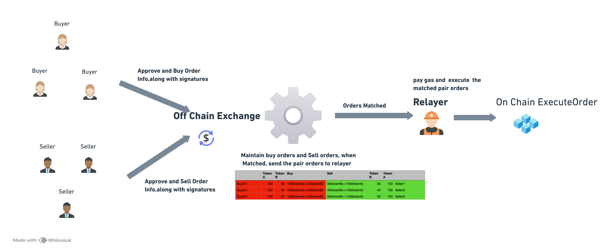
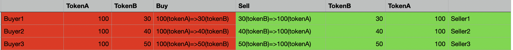
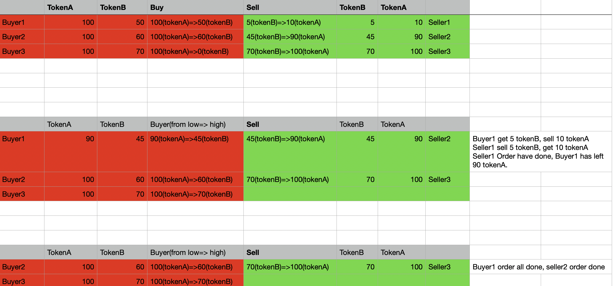

# Gasless_exchange_relayer_new

# 1. Intro

- Gasless exchange. This project simulates off-chain books orders. users exchange two ERC20 token, no need paying gas. Just sign approvals and orders and send those to the exchange.

- Work Flow



- Use Openzepplin action relayer

# 2. Off-chain order books order how to deal orders

1. Maintain books order,when the highest buy order's price matched the seller's lowest price, send the buy order and sell order along with their corrosepnding's signatures to the relayer.

   

2. There are two different matched orders

   1. As above show, complete matched. buy order and sell order have all dealed. buyer1 get 30 tokenB, seller1 get 100 tokenA
   2. Alough the price matched, but there are amount left

     
        
    Such as above, when off chain exchange send the matched order to relayer. seller1 order has dealed, buy1 order has left amount tokenA.
    
    **For the left order,the off chain exchange should maintain the left amount, unitl all token have been dealed**

# 3. On-chain smart contract how to deal with matched orders

1. There are two types orders: First Order and Left Order

- When user signed an order, which was firstly executed, called First Order.
- If the First Order have left amount, called Left Order and the contract store the left token amount for this order.
  **Off chain orders should matain the order status, when send matched orders,should add order status**

2.  The check list

```
    1.  Check this contract have enough approval for tokenA and tokenB

    2.  Check the buy order and sell order price is matched

    3.  No Matter for the buy order or sell order, if the order is First Order, should check the signature is valid, if which is left order, should
        check the left amount is enough. Meanwhile should check the timestamp.

    4.  transfer token

        4.1 completed matched
        4.2 part matched

              4.2.1 if there is left amount, should update the left amount, if all have been used, should delete the order.
```

# 3. On-chain smart contract design

0. [ExecuteOrder](contracts/ExecuteOrder.sol)

1. Like ERC20Permit using EIP712, only this contract can execute the trade by verifying the signature.

2. For the Left Order, check the original signature and other related info, can't beyond the order amount.

# 4. Test cases

1. Simulate different situations test cases

   1. [OrderBasic](test/OrderBasic.test.js): test permitToken and complete matched trade.
   2. [OrdersPartMatch](test/OrdersPartMatch.test.js): test part matched trade. `buyer 100 tokenA => 50 tokenB, seller 5 tokenB => 10 tokenA`
   3. [OrdersPartMatchMultiTimes](test/OrdersPartMatchMultiTimes.test.js):
      - 1th order: buyer order: 100 tokenA => 50 tokenB, seller order: 5 tokenB => 10 tokenA
        - buy order left:buyer 90 tokenA => 45 tokenB,seller order: 5 tokenB => 10 tokenA has all traded
        - enter new sell order:seller order: 45 tokenB => 90 tokenA
      - 2th order: buyer order: 90 tokenA => 45 tokenB, seller order: 45 tokenB => 90 tokenA

2. using opezenpplin relayer(should adjust some params to make it work)

   1. [simulate_executeOrders](scripts/simulate_executeOrders.js). `npx hardhat run scripts/transferERC20Tokens.js --network sepoli`

      0. Before doing, should call [simulatePermitTokenA](scripts/simulatePermitTokenA.js) or [simulatePermitTokenB](scripts/simulatePermitTokenB.js), make the ExecuteOrder has enough approval.
      1. generate request file
      2. call `yarn relay`

   2. [simulate_executeLeftOrders](scripts/simulate_executeLeftOrders.js).

# plus 20240308

1. Now price using completly matched, such as if buyer: 100 tokenA => 50 tokenB, seller 5 tokenB => 10 tokenA , only price completly matched can execute.
2. Should accept more possbilities, such as buyer buy tokenB 0.5 tokenA, if seller sell tokenB less than 0.5 tokenB. also should accept. The price can pick the middle price of the buyer and seller price.

# 5. Other Info

1. test addresses in sepoli

```
{
  "ERC20TokenA": "0x463123c5C17605b00fFF2D11C15536e78f64014a",
  "ERC20TokenB": "0x8E14305E51722FE469A5Fd87308b408417D4D9C0",
  "ExecuteOrder": "0x111876c28a4971194B8c59962dF6aD45fbd80235"
}
```

2. This project just simulate necessary off_chain orders match situations, others ignore. and the ExecuteOrder contract test cases don't cover some edge cases.
   such as blew situation.

   - 1th order: buyer order: 100 tokenA => 50 tokenB, seller order: 5 tokenB => 10 tokenA
     - buy order left:buyer 90 tokenA => 45 tokenB,seller order: 5 tokenB => 10 tokenA has all traded
     - enter new sell order:seller order: 20 tokenB => 40 tokenA
   - 2th order: buyer order: 90 tokenA => 45 tokenB, seller order: 20 tokenB => 40 tokenA, **buy order still has left**.

3. Current desgin, relayer directly call contracts, but from a security perpespective, should add trust contract like openzepplin ERC2771Forwarder which have the right calling the target contract.

4. questions?
   1. Comparing the left Order desgin, are there more simple desgins? Does this have some vulnerabilities?
